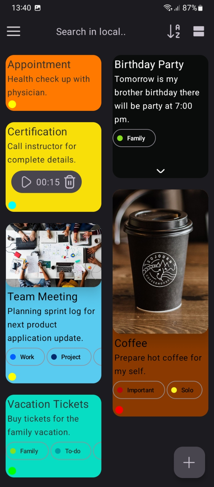
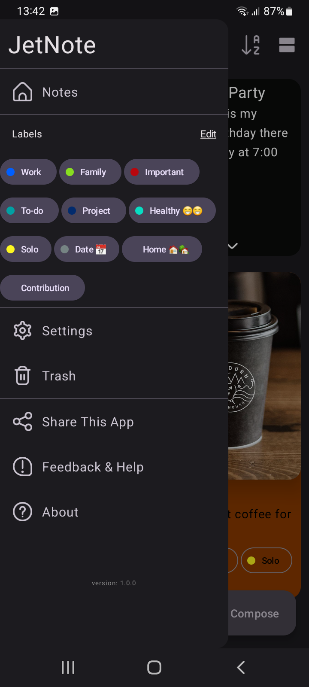

# JetNote
JetNote is modern note android application written by kotlin language and [jetpack-compose](https://github.com/JetBrains/compose-jb) toolkit. The app dealing with Room for Database, Koin dependency injection, Coroutine the non-blocking programming, Navigation-Compose, DataStore, ExoPlayer to play the recorded media in the app, CameraX to take and save picture, And more to make it good app that inspired by google app **keep Notes**.

[](https://www.android.com/)
[](https://kotlinlang.org)
[](https://developer.android.com/jetpack/androidx/releases/compose)
[](https://kotlinlang.org/docs/reference/coroutines-overview.html)
[](https://gradle.org)
[](https://www.apache.org/licenses/LICENSE-2.0)
[](https://github.com/City-Zouitel/JetNote/actions/workflows/android.yml)
[](https://www.codefactor.io/repository/github/city-zouitel/jetnote)
[](https://wakatime.com/badge/user/218fee08-512f-4a26-b56d-104925a888b1/project/a2f2f997-6877-4090-9458-3ac93895d372)

## Screenshots

<p float="left">
  
  
  
</p>


## Download
   <a href="https://apt.izzysoft.de/fdroid/index/apk/city.zouitel.jetnote">
    
  </a>
  
 [](https://github.com/City-Zouitel/JetNote/releases/latest)


## Libraries
### [Kotlinx-coroutines](https://github.com/Kotlin/kotlinx.coroutines) 
A coroutine is a concurrency design pattern that you can use on Android to simplify code that executes asynchronously.

### [Voyager](https://voyager.adriel.cafe/) 
A multiplatform navigation and viewmodel library built for, and seamlessly integrated with, Jetpack Compose.

### [Room](https://developer.android.com/jetpack/androidx/releases/room) 
The Room persistence library provides an abstraction layer over SQLite to allow for more robust database access while harnessing the full power of SQLite.

### [DataStore](https://developer.android.com/topic/libraries/architecture/datastore)
Jetpack DataStore is a data storage solution that allows you to store key-value pairs or typed objects with protocol buffers. DataStore uses Kotlin coroutines and Flow to store data asynchronously, consistently, and transactionally.

### [Koin](https://github.com/InsertKoinIO/koin)
Koin is a pragmatic lightweight dependency injection framework for Kotlin developers.

### [Sketchbook](https://github.com/GetStream/sketchbook-compose) 
Jetpack Compose canvas library that helps you draw paths, images on canvas with color pickers and palettes.

### [accompanist](https://github.com/google/accompanist) 
Accompanist is a group of libraries that aim to supplement Jetpack Compose with features that are commonly required by developers but not yet available.
<details>

1. **Permissions:** A library that provides Android runtime permissions support for Jetpack Compose.

2. **Pager:** A library that provides utilities for building paginated layouts in Jetpack Compose, similar to Android's ViewPager.

3. **Navigation-Animation:** A library which provides Compose Animation support for Jetpack Navigation Compose.

4. **SwipeRefresh:** A library that provides a layout implementing the swipe-to-refresh UX pattern, similar to Android's SwipeRefreshLayout.

5. **Flow Layouts:** A library that adds Flexbox-like layout components to Jetpack Compose.
</details>

### [ExoPlayer](https://exoplayer.dev/)
ExoPlayer is an application level media player for Android. It provides an alternative to Android’s MediaPlayer API for playing audio and video both locally and over the Internet.

### [CameraX](https://developer.android.com/jetpack/androidx/releases/camera)
CameraX is an addition to Jetpack that makes it easier to add camera capabilities to your app. The library provides a number of compatibility fixes and workarounds to help make the developer experience consistent across many devices.

### [LiveData](https://developer.android.com/topic/libraries/architecture/livedata)
LiveData is an observable data holder class. Unlike a regular observable, LiveData is lifecycle-aware, meaning it respects the lifecycle of other app components, such as activities, fragments, or services. This awareness ensures LiveData only updates app component observers that are in an active lifecycle state.

### [Coil](https://coil-kt.github.io/coil/)
An image loading library for Android backed by Kotlin Coroutines. 

### [AboutLibraries](https://github.com/mikepenz/AboutLibraries)
Collects all dependency details including licenses at compile time, and offers simple APIs to visualize these in the app.

### [WorkManager](https://developer.android.com/topic/libraries/architecture/workmanager)
WorkManager is the recommended solution for persistent work. Work is persistent when it remains scheduled through app restarts and system reboots.

## The App Hierarchy

```
                          *****************************
                          |        UI Controller      |
                          *****************************
                                        |
                                        |
                          *****************************
                          |        View Module        |
                          *****************************
                                        |
                                        |
                          *****************************
                          |         Repository        |
                          *****************************
                                        |
                      --------------------------------------
                      |                                     |
          *****************************      *****************************
          |            Room           |      |        ...........        |
          *****************************      *****************************
```

### Check it out [Project manager](https://github.com/orgs/City-Zouitel/projects/1/views/1) to see what's going on and what's coming in this project.

## License
```text
Copyright 2022 The Android Open Source Project
 
Licensed under the Apache License, Version 2.0 (the "License");
you may not use this file except in compliance with the License.
You may obtain a copy of the License at

    https://www.apache.org/licenses/LICENSE-2.0

Unless required by applicable law or agreed to in writing, software
distributed under the License is distributed on an "AS IS" BASIS,
WITHOUT WARRANTIES OR CONDITIONS OF ANY KIND, either express or implied.
See the License for the specific language governing permissions and
limitations under the License.
```
